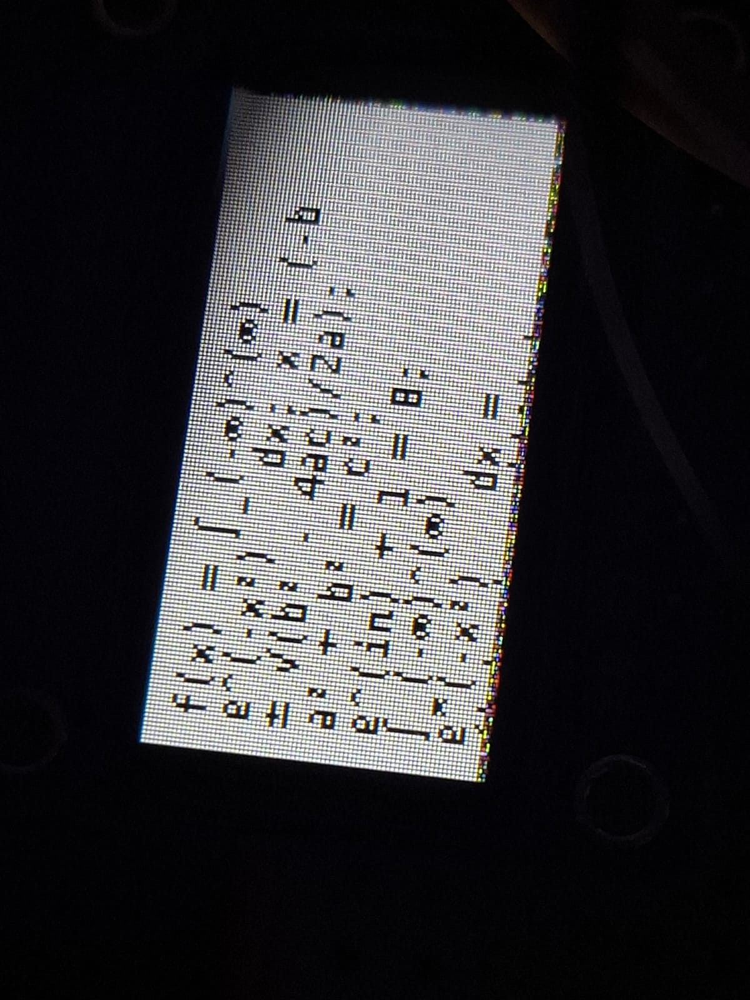

# ESP32 LaTeX-to-Unicode Text Renderer

A **standalone ESP32 display program** that parses **LaTeX-style mathematical expressions** and renders them on a **160×80 ST7735 TFT screen** using **Unicode bitmap fonts**.

This project focuses **only on LaTeX-style text processing and display**

---

## ✨ Features

### 📐 Lightweight LaTeX Parsing

The renderer supports a **useful subset of LaTeX**, converted into **Unicode math symbols** suitable for embedded displays.

Supported constructs:

* Superscripts: `x^2`, `x^{n+1}`
* Subscripts: `x_1`, `a_{ij}`
* Fractions: `\\frac{a}{b}` → `(a/b)`
* Square roots: `\\sqrt{x}` → `√(x)`
* Binomials: `\\binom{n}{k}` → `C(n,k)`

---

### 🔣 Math Symbol Coverage

Includes built-in mappings for:

* Greek letters: α β γ Δ Ω …
* Calculus: ∫ ∬ ∭ ∇ ∂ ∞
* Relations: ≤ ≥ ≠ ≈ ≡
* Logic: ∀ ∃ ∧ ∨ ¬ ⇒ ⇔
* Set theory: ∈ ⊂ ⊆ ∩ ∪ ∅
* Operators: × ÷ · ± √
* Arrows: → ← ⟶ ⇐ ⇒

All mappings are implemented in `getLatexSymbol()`.

---

### 🖥️ TFT Text Rendering

* ST7735 160×80 TFT display
* Unicode rendering via **U8g2_for_Adafruit_GFX**
* Automatic:

  * Word wrapping
  * Unicode-aware width estimation
  * Vertical scrolling

---

### 🧭 User Interaction

* Hardware button for manual scrolling
* Scroll wraps automatically at end of content

---

## 🧠 Processing Pipeline

```
LaTeX-style input string
        ↓
processLatex()
        ↓
Unicode math string
        ↓
U8g2 bitmap font
        ↓
TFT screen
```

---

## 🔤 Font System (CRITICAL)

### ✅ Required Font Format

> **ESP32 can only render bitmap fonts**

✔ Correct format: **BDF (Bitmap Distribution Format)**
❌ TTF / OTF are NOT supported at runtime

Fonts must be converted to **C header arrays** and stored in flash.

---

### 📁 Included Font: DejaVu Sans

```cpp
#include "dejavu_sans.h"
extern const uint8_t dejavu_sans[];

u8g2.setFont(dejavu_sans);
```

Font properties:

* Unicode-capable (math symbols)
* ~36 KB flash usage
* Stored in `.rodata` section

---

### 🔧 Font Conversion (bdfconv.exe)

This project expects **`bdfconv.exe`** in the repository.

Example conversion:

```bash
bdfconv.exe dejavu_sans.bdf -o dejavu_sans.h -f 1 -v
```

Recommended Unicode ranges:

```
U+0020–007E   ASCII
U+03B1–03C9   Greek
U+2200–22FF   Math operators
U+2190–21FF   Arrows
```

⚠️ Subset glyphs aggressively to save flash memory.

---

## 🧩 Hardware Pin Configuration

### TFT Display

| Signal | GPIO |
| ------ | ---- |
| CS     | 15   |
| DC     | 2    |
| RST    | 4    |
| SCLK   | 18   |
| MOSI   | 23   |
| BLK    | 27   |

### Scroll Button

| Signal | GPIO |
| ------ | ---- |
| BTN    | 5    |

---

## 🛠️ Libraries Used

* `Adafruit_GFX`
* `Adafruit_ST7735`
* `U8g2_for_Adafruit_GFX`
* `SPI`

---

## 📝 Usage Example

```cpp
globalResult = "\\frac{a^2 + b^2}{c_1} = \\sqrt{x}";
drawWrappedText();
```

Rendered output:

```
(a² + b²)/c₁ = √(x)

```

---

## 🚀 Best Practices

* Do NOT attempt full LaTeX rendering
* Always convert LaTeX → Unicode
* Use BDF fonts only
* Avoid dynamic memory during rendering
* Keep math expressions linear and readable

---

## 📌 Use Cases

* Embedded math visualizers
* Educational ESP32 projects
* Scientific instrumentation displays
* Formula viewers on low-cost hardware

---
